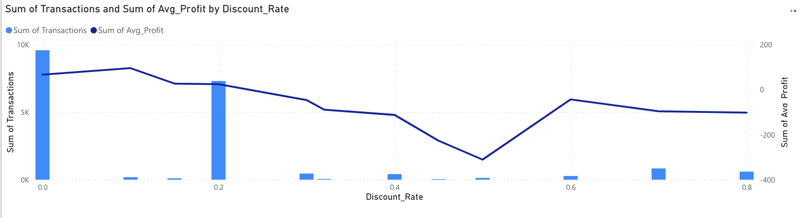

 🛒 Retail Sales Dashboard Project (SQL + Power BI)

This project involves analyzing retail sales data using **MySQL** and **Power BI** to extract actionable business insights. It focuses on identifying profitable segments, loss-making regions, sales trends, and customer behavior to guide data-driven decisions.

---

## ❗ Problem Statement

The retail company is experiencing inconsistent profits across regions and product categories. Management lacks a clear understanding of which areas are driving growth and which are causing losses. They need a comprehensive dashboard that:

- Tracks overall sales and profitability trends
- Highlights top- and bottom-performing states, regions, and categories
- Identifies customer segments that drive revenue
- Shows the impact of discounts on profit margins
- Helps prioritize strategies for product focus and customer retention

**Goal:** Build a data pipeline and an interactive dashboard that empowers decision-makers with clear, visual insights derived from historical sales data.

---

## 📦 Dataset

- **Source**: [Superstore Sales Dataset on Kaggle](https://www.kaggle.com/datasets/vivek468/superstore-dataset-final)
- **Description**: Includes orders data with fields such as `Order Date`, `Sales`, `Profit`, `Quantity`, `Customer Segment`, `State`, `Category`, and `Discount`.

---

## 🧰 Tools Used

- **MySQL**: Data extraction, filtering, and aggregations
- **Power BI**: Dashboard creation, KPI cards, slicers, charts
- **CSV**: Intermediate format for transferring SQL results to Power BI
- **GitHub**: Project versioning and portfolio showcase

---

## 📊 Dashboard Overview

Key visualizations in the dashboard:

- KPI Cards: Total Sales, Profit, Quantity
- Monthly Sales and Profit Trend
- Sales by State and Region
- Profit by Product Category/Sub-Category
- Sales by Customer Segment
- Discount vs. Profit analysis
- Top 10 Customers by Revenue

> 📸 **Sample Dashboard Screenshots available in `/visuals/dashboard_screenshots/`**

---
## ⚙️ Workflow Summary

1. **Data Source**: Downloaded from Kaggle
2. **Cleaning**: Basic preprocessing in Excel (e.g., handling missing values, correcting formats)
3. **Database Setup**: Imported the cleaned dataset into MySQL for structured querying and analysis
4. **SQL Analysis**: Wrote modular SQL queries to derive KPIs and filtered insights
5. **Export**: Exported query results as CSV files for each metric and chart
6. **Power BI**: Loaded all CSVs into Power BI to build a unified, interactive dashboard

---
## 📊 Business Insights

### 1. 🧾 Overall Business Performance  
  
- The business has processed over **5,000 orders**, generating **₹4.59M in sales** and **₹572.79K in profit**.  
- This indicates **strong revenue performance** with **healthy profit margins**.

---

### 2. 🖨️ Top-Selling Products  
  
- The **Canon imageCLASS 2200 Advanced Copier** dominates with **25%+** contribution to sales.  
- Other notable products:  
  - **Hewlett Packard LaserJet**  
  - **HP Designjet T520**  
- High demand for **premium printing and binding equipment** is evident.

---

### 3. 📂 Category-wise Sales Distribution  
  
- **Technology** leads with **$1.67M+** in sales, driven by **Phones** and **Machines**.  
- **Furniture** and **Office Supplies** are nearly tied at **$1.48M each**.  
- **Phones** and **Chairs** are standout performers.

---

### 4. 📅 Monthly Sales Trend  
  
- Sales **peak in November and December**, likely due to holiday and year-end purchasing.  
- **February shows a dip**, with growth resuming by mid-year.  
- A **spike in September** may align with seasonal/back-to-school demand.

---

### 5. 🧑‍💼 Segment-wise Profitability  
  
- **Home Office** segment leads in **profit margin**, possibly due to premium pricing or efficiency.  
- **Corporate** follows, suggesting solid B2B performance.  
- **Consumer** trails, hinting at thinner margins or discount-heavy products.

---

### 6. 🗺️ State-wise Sales Distribution  
  
- **Texas** contributes **24.12%** of total sales, followed by **Pennsylvania (16.51%)** and **Florida (12.68%)**.  
- **Colorado**, **Tennessee**, and **Oregon** contribute **<5%** each.  
- Strong regional performance in the **South and East**, with **growth potential in the West**.

---

### 7. 💸 Top Loss-Making Products  
  
- Biggest loss-maker: **Cubify CubeX 3D Printer Double Head Print** (**loss > $15K**)  
- Other major losses:  
  - **Lexmark MX611dhe Laser Printer**  
  - **Cubify CubeX 3D Printer Triple Head Print**  
- Losses mainly come from **high-end tech and office equipment**.

---

### 8. ⚠️ Discount Impact Insight  
  
- Sales without discounts (0%) have the highest transactions and profits, showing strong full-price performance.
- Discounts beyond 20% sharply reduce both transactions and average profit, especially around 40–60%.
- Deep discounts (>40%) are ineffective and hurt profitability with minimal sales impact.

---

